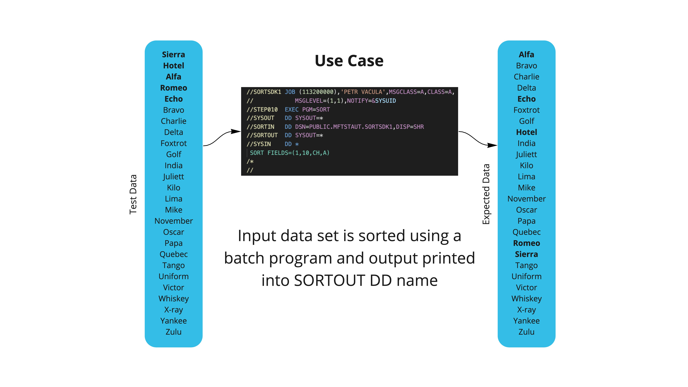
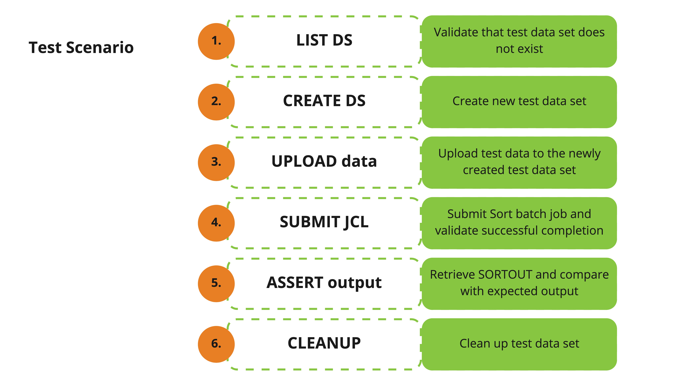

# Mainframe Test Automation

This repo is used to illustrate automation of mainframe tests using open source testing frameworks.

Open the individual frmwrk-* subdirectories as your projects to explore those:

1.  `frmwrk-jest`

    Jest Testing Framework that illustrates the use of Zowe CLI and Zowe Node.js SDK.

2.  `frmwrk-mocha`

    Mocha Testing Framework is used together with Chai assertion library and Zowe CLI.

3.  `frmwrk-robot`

    Robot Testing Framework using Zowe Python SDK.

## Following picture illustrates the used testing Use Case:

## Sample automated test cases are then structured according to this test scenario:

