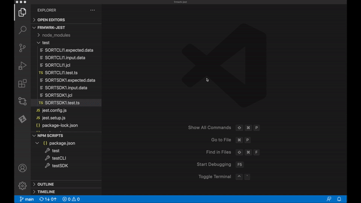

# Sample test cases for Jest testing framework.

Sample project illustrating use of Jest Testing Framework to test mainframe applications. Sample test cases cover the use Zowe CLI as well as Zowe Node.js SDK.

## Prerequisites
* [Node.js](https://nodejs.org/)
* Zowe CLI with defined default z/OSMF profile for Zowe CLI samples
    * [Installing Zowe CLI from an online registry](https://docs.zowe.org/stable/user-guide/cli-installcli.html#installing-zowe-cli-from-an-online-registry)
    * [Using profiles](https://docs.zowe.org/stable/user-guide/cli-usingcli.html#using-profiles)

## Recommendations
* [Visual Studio Code](https://code.visualstudio.com/)
* [Jest Runner VSCode extension](https://marketplace.visualstudio.com/items?itemName=firsttris.vscode-jest-runner)

## How to initialize this Jest project - cloned from git repository
1. Open just the frmwrk-jest folder as your project
2. Install needed packages by executing following command form the frmwrk-jest folder

        npm install

## How to run test cases
1. Update variables in `SORTCLI1.test.js`
2. Update jobcard in `SORTCLI1.jcl` (and the data set name, if needed)
3. If prerequisites are met, simply execute the following command from the frmwrk-jest:

        npm run test

    Optionally use defined NPM Scripts through the VSCode Explorer:
    * test
        * to run all test cases
    * testCLI
        * to run only CLI test case
    * test SDK
        * to run only SKD test case

    Yet another option is using Jest Runner in VSCode. It adds run | debug buttons in front of every test case and test suite.

## Files
* `SORTCLI1.expected.data`
    * Expected data output from the Sort job. It is used for asserting the job output.
* `SORTCLI1.input.data`
    * Input data for the Sort job. It is uploaded to data set for the job to process.
* `SORTCLI1.jcl`
    * Sort job JCL.
* `SORTCLI1.test.ts`
    * This is the actual Jest Testing Framework test case using Zowe CLI to communicate with the mainframe.

* `SORTSDK1.expected.data`
    * Expected data output from the Sort job. It is used for asserting the job output.
* `SORTSDK1.input.data`
    * Input data for the Sort job. It is uploaded to data set for the job to process.
* `SORTSDK1.jcl`
    * Sort job JCL.
* `SORTSDK1.test.ts`
    * This is the actual Jest Testing Framework test case using Zowe Node.js SDK to communicate with the mainframe.

## How to initialize your Jest project - when starting completely from scratch
You will need these steps only if you start your own brand new project.

1. Initialize package.json

    `npm init -y`

2. Install needed packages

    `npm install -D jest typescript ts-jest @types/jest @zowe/imperative @zowe/cli`

3. Create ts-jest configuration to use typescript with Jest

    `npx ts-jest config:init`
