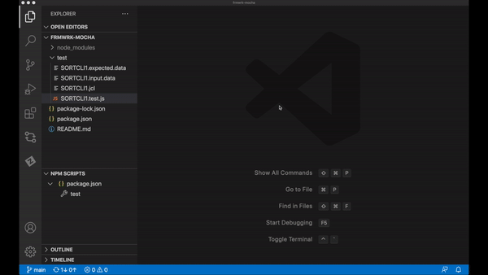

# Mainframe Test Automation using Mocha.js testing framework

Sample project illustrating use of Mocha.js testing framework together with Chai assertion library to test mainframe applications. The samples use Zowe CLI to perform mainframe actions.

## Prerequisites
* [Node.js](https://nodejs.org/)
* Zowe CLI with defined default z/OSMF profile for Zowe CLI samples
    * [Installing Zowe CLI from an online registry](https://docs.zowe.org/stable/user-guide/cli-installcli.html#installing-zowe-cli-from-an-online-registry)
    * [Using profiles](https://docs.zowe.org/stable/user-guide/cli-usingcli.html#using-profiles)

## Recommendations
* [Visual Studio Code](https://code.visualstudio.com/)

## How to initialize this Mocha.js project - cloned from git repository
1. Open just the frmwrk-mocha folder as your project
2. Install needed packages by executing following command form the frmwrk-mocha folder

        npm install

## How to run test cases
1. Update variables in `SORTCLI1.test.js`
2. Update jobcard in `SORTCLI1.jcl` (and the data set name, if needed)
3. If prerequisites are met, simply execute the following command from the frmwrk-mocha folder:

        npm run test

    Optionally use defined NPM Script through the VSCode Explorer.

## Files
* `SORTCLI1.expected.data`
    * Expected data output from the Sort job. It is used for asserting the job output.
* `SORTCLI1.input.data`
    * Input data for the Sort job. It is uploaded to data set for the job to process.
* `SORTCLI1.jcl`
    * Sort job JCL.
* `SORTCLI1.test.js`
    * This is the actual Mocha.js Testing Framework test case.
