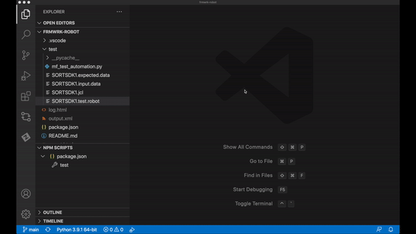

# Mainframe Test Automation using Robot testing framework

Sample project illustrating use of Robot Testing Framework together with Zowe Python Client SDK to test mainframe applications.

## Prerequisites
* Python (www.python.org) 3.5 or above
* Robot Framework
* Zowe Python SDK

To install the required Python packages, simply run:

    python -m pip install -r requirements.txt

## Recommendations
* Visual Studio Code
* Python VSCode extension
* Pylance VSCode extension
* Robot Framework Language Server VSCode extension

## Files
* `mf_test_automation.py`
    * Python library defining Robot keywords specific to Mainframe Testing. It uses Zowe Python library to perform mainframe actions.
* `SORTSDK1.expected.data`
    * Expected data output from the Sort job. It is used for asserting the job output.
* `SORTSDK1.input.data`
    * Input data for the Sort job. It is uploaded to data set for the job to process.
* `SORTSDK1.jcl`
    * Sort job JCL.
* `SORTSDK1.test.robot`
    * This is the actual Robot Testing Framework test case.

## How to run the test case
1.  Update variables in `SORTSDK1.test.robot`
2.  Update jobcard in `SORTSDK1.jcl` (and the data set name, if needed)
3.  If prerequisites are met, simply run:

        robot test/SORTSDK1.test.robot